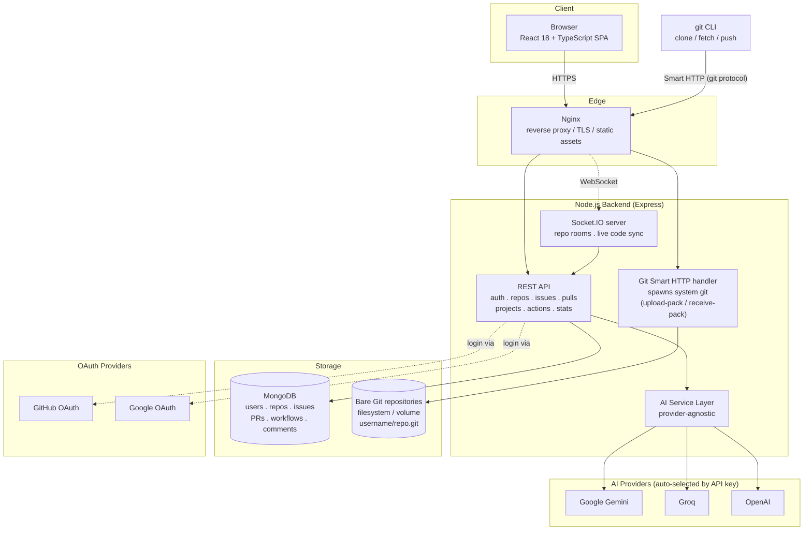

# GitPage — AI-Native Git Collaboration Platform

GitPage is a self-hostable, GitHub-inspired platform that combines real Git repository hosting (Smart HTTP protocol), issue/PR collaboration workflows, and AI-assisted developer tooling in a single application.

Built with **React + TypeScript** on the frontend and **Node.js + Express + MongoDB** on the backend, with real Git operations shelled out to the system `git` binary and real-time updates delivered over **Socket.IO**.

---

## Table of Contents

- [Overview](#overview)
- [Core Features](#core-features)
- [AI Features](#ai-features)
- [Architecture](#architecture)
- [Tech Stack](#tech-stack)
- [Repository Layout](#repository-layout)
- [Getting Started](#getting-started)
- [Environment Variables](#environment-variables)
- [Running with Docker](#running-with-docker)
- [Roadmap](#roadmap)
- [Contributing](#contributing)
- [License](#license)

---

## Overview

GitPage lets users register, authenticate (email/password or GitHub/Google OAuth), create repositories, and push/pull to them over standard Git tooling (`git clone`, `git push`) via a hand-rolled Smart HTTP backend — no external Git server (e.g. Gitea, GitLab) is used. On top of that, it layers a GitHub-style collaboration surface: issues, pull requests, activity feeds, contribution graphs, and workflow/run tracking.

AI is integrated as a first-class service rather than a bolt-on. A single backend AI service abstracts over multiple providers (Google Gemini, Groq, or OpenAI, selected automatically based on which API key is configured) and exposes it through a dedicated `/api/ai` surface used for chat, debugging, PR review, test generation, and more.

---

## Core Features

### Repository Management
- Create and browse repositories per user/organization namespace
- Real Git storage as bare repositories on disk (`username/reponame.git`)
- Smart HTTP Git protocol support — clone, fetch, and push with the standard `git` CLI
- File explorer and commit history browsing

### Code Navigation
- Monaco-based in-browser code editor and viewer
- Syntax highlighting via Prism / rehype-highlight
- Branch selection and diff viewing

### Issues & Pull Requests
- Issue creation, labeling, and triage
- Pull request creation and review workflows
- Diff visualization backed by a git-diff utility layer

### Real-Time Collaboration
- Socket.IO server for live updates
- Room-based events per repository (`join-repo` / `leave-repo`)
- Live code-change and cursor-position broadcasting for collaborative editing scenarios

### Authentication & Security
- JWT-based session authentication
- OAuth login via GitHub and Google
- `helmet`, `cors`, and tiered `express-rate-limit` rules (stricter limits on AI endpoints)

### Organizations, Projects & Actions
- Project boards
- Workflow / workflow-run tracking (CI-style, GitHub Actions-inspired data model)
- Activity feed and contribution statistics endpoints

---

## AI Features

All AI features are served from a single backend AI service that automatically selects a provider — **Gemini**, **Groq**, or **OpenAI** — based on whichever API key is present in the environment (with `AI_PROVIDER` available to force a specific one). If no key is configured, AI endpoints respond gracefully with an "AI not configured" message rather than failing.

| Endpoint | Purpose |
|---|---|
| `POST /api/ai/chat` | Conversational assistant for repository/codebase questions |
| `POST /api/ai/analyze` | General code analysis |
| `POST /api/ai/debug` | Debugging suggestions from code + error context |
| `POST /api/ai/review-pr` | Automated pull request diff review |
| `POST /api/ai/explain` | Human-readable explanations of unfamiliar code |
| `POST /api/ai/generate-tests` | Unit test generation from implementation code |
| `POST /api/ai/fix-bug` | Suggested fixes for a described bug |
| `POST /api/ai/optimize` | Performance/readability improvement suggestions |
| `POST /api/ai/commit-message` | Commit message generation from a diff |
| `POST /api/ai/triage` | Issue triage: priority, summary, suggested assignee |
| `POST /api/ai/suggest-labels` | Label suggestions for an issue |
| `GET /api/ai/insights/dashboard` | Aggregated AI insights across a user's repositories |

All AI routes are protected by JWT auth and a dedicated rate limiter (20 requests/minute by default).

---

## Architecture

GitPage runs as three services behind an Nginx reverse proxy: a static/SPA frontend, an Express API/Git/WebSocket backend, and MongoDB for application data. Git object data is stored directly on the backend's filesystem (or a mounted volume) as bare repositories, and is served using the Git Smart HTTP protocol by spawning the system `git` process rather than through a third-party Git server.



**Request flow highlights**

1. **Web traffic** (SPA + REST calls) hits Nginx, which serves the built frontend and proxies `/api/*` to the Express backend.
2. **Git traffic** (`git clone`/`push` against `https://host/username/repo.git`) is matched by a dedicated route before the JSON body parser and handed to a Smart HTTP handler that shells out to the system `git` binary against the bare repository on disk.
3. **Real-time traffic** (collaborative cursors/code sync) upgrades to a Socket.IO WebSocket connection, scoped to per-repository rooms.
4. **AI requests** go through JWT-protected `/api/ai/*` routes into a single AI service module, which picks whichever configured provider (Gemini → Groq → OpenAI, in that priority) is available and normalizes its response.
5. **Auth** is JWT-based for the API, with optional OAuth handoff to GitHub or Google for login.

---

## Tech Stack

### Frontend
| Technology | Purpose |
|---|---|
| React 18 + TypeScript | UI framework |
| Vite | Build tooling / dev server |
| Redux Toolkit + React Query | Client and server state management |
| Tailwind CSS | Styling |
| Monaco Editor | In-browser code editor |
| Socket.IO Client | Real-time communication |
| React Router | Client-side routing |
| Axios | HTTP client |

### Backend
| Technology | Purpose |
|---|---|
| Node.js + Express (TypeScript) | API server |
| MongoDB + Mongoose | Application data store |
| Socket.IO | Real-time infrastructure |
| JSON Web Tokens | Authentication |
| `simple-git` / system `git` via `child_process` | Git repository operations & Smart HTTP protocol |
| `@google/generative-ai`, `groq-sdk`, `openai` | AI provider SDKs |
| `helmet`, `express-rate-limit`, `cors` | API hardening |
| Docker + Nginx | Containerization & reverse proxy |

---

## Repository Layout

```
Gitpage-main/
├── frontend/                # React + TypeScript SPA (Vite)
│   ├── src/
│   │   ├── components/      # AI, Repository, Dashboard, Layout, UI components
│   │   ├── pages/            # Route-level pages (Auth, Repository, Dashboard, AI, Settings...)
│   │   ├── services/         # API clients (auth, repo, AI)
│   │   ├── store/             # Redux slices (auth, repo, AI)
│   │   └── hooks/             # useAuth, useRepo, useAI, useCurrentUser
│   └── Dockerfile / nginx.conf
├── backend/                 # Express + TypeScript API
│   ├── server.ts             # App entry point: middleware, routes, Socket.IO, DB connect
│   ├── src/
│   │   ├── routes/            # auth, repos, repository, issues, pulls, actions, ai, stats...
│   │   ├── controllers/       # projectController, etc.
│   │   ├── services/          # aiService.ts, gitService.ts
│   │   ├── models/            # User, Repository, Issue, PullRequest, Workflow, Comment...
│   │   ├── middleware/        # auth (JWT), errorHandler
│   │   └── utils/             # gitOperations, gitDiff
│   ├── repos/                 # Bare Git repositories live here in local/dev setups
│   └── Dockerfile
├── docker-compose.yml        # mongodb + backend + frontend + nginx services
└── README.md
```

---

## Getting Started

### Prerequisites
- Node.js 18+ (backend `engines` requires 18+; frontend targets 20+ for local dev)
- MongoDB 7+ (local instance or the bundled Docker service)
- `git` available on the backend host (used directly for Smart HTTP operations)
- An API key from Gemini, Groq, and/or OpenAI (optional — required only for AI features)

### Clone the repository

```bash
git clone https://github.com/yourusername/gitpage.git
cd gitpage
```

### Install dependencies

```bash
# Frontend
cd frontend
npm install

# Backend
cd ../backend
npm install
```

### Configure environment variables

Copy the example files and fill in real values:

```bash
cp backend/.env.example backend/.env
cp frontend/.env.example frontend/.env
```

See [Environment Variables](#environment-variables) below for what each one does.

### Run the development servers

```bash
# Backend (from /backend)
npm run dev

# Frontend (from /frontend, in a separate terminal)
npm run dev
```

The frontend defaults to `http://localhost:3000` and expects the API at the URL configured by `VITE_API_URL` (default `http://localhost:5000/api`); the backend defaults to `http://localhost:5000`.

---

## Environment Variables

### Backend (`backend/.env`)

| Variable | Description |
|---|---|
| `NODE_ENV` | `development` or `production` |
| `PORT` | API server port (default `5000`) |
| `MONGODB_URI` | MongoDB connection string |
| `JWT_SECRET` | Secret used to sign JWTs (**required** — the server refuses to start without it) |
| `JWT_EXPIRES_IN` | Token lifetime (default `7d`) |
| `CLIENT_URL` | Frontend origin, used for CORS and Socket.IO |
| `REPOS_DIR` / `REPO_STORAGE_PATH` | Filesystem path where bare Git repositories are stored |
| `AI_PROVIDER` | Force a specific AI provider: `gemini`, `groq`, or `openai` (optional — auto-detected from available keys otherwise) |
| `GEMINI_API_KEY` | Google Gemini API key |
| `GROQ_API_KEY` | Groq API key |
| `OPENAI_API_KEY` | OpenAI API key |
| `AI_MODEL` | Override the default model for the active provider |
| `AI_MAX_TOKENS` / `AI_TEMPERATURE` | Generation parameters (defaults `2000` / `0.7`) |
| `DNS_SERVERS` | Optional custom DNS servers for outbound requests (e.g. OAuth callbacks) |

### Frontend (`frontend/.env`)

| Variable | Description |
|---|---|
| `VITE_API_URL` | Base URL of the backend REST API |
| `VITE_SOCKET_URL` | Base URL of the Socket.IO server |
| `VITE_APP_NAME` | Display name used in the UI |

---

## Running with Docker

A full stack (`mongodb`, `backend`, `frontend`, `nginx`) is defined in `docker-compose.yml`, with Nginx as the only service exposed on ports 80/443 and everything else reachable only on the internal Docker network.

```bash
cp backend/.env.example backend/.env   # fill in real secrets first
docker compose up --build
```

Nginx configuration (TLS certs via Certbot, reverse-proxy rules) is expected under `./nginx/conf`, `./certbot/conf`, and `./certbot/www` on the host, as referenced by the volume mounts in `docker-compose.yml`.

---

## Roadmap

- CI/CD-style workflow execution (the data model for workflows/runs already exists)
- Kubernetes deployment manifests
- Semantic/codebase-wide search
- Distributed or object-storage-backed repository storage
- Self-hosted enterprise deployment guide
- Collaborative live editing (building on the existing Socket.IO cursor/code-change events)
- GitPage CLI

---

## Contributing

Contributions and feature suggestions are welcome. Fork the repository, open an issue to discuss significant changes, and submit a pull request.

---

## License

MIT License
